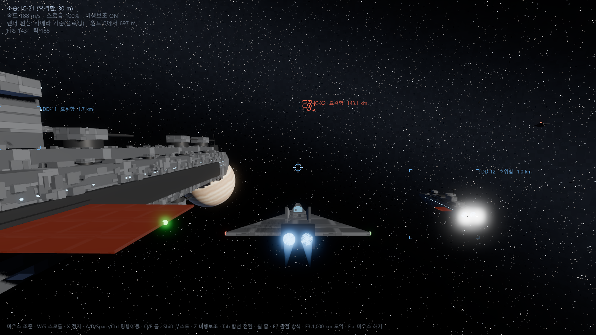

# Space Fleet (가칭 Project Fleet)

3D 우주 함대전 프로토타입. Godot 4.7 .NET + C#.

계획과 진행 상황은 [docs/PLAN.md](docs/PLAN.md)에 있다.



## 필요한 것

- Godot 4.7.2 .NET: `%LOCALAPPDATA%\Programs\Godot\Godot_v4.7.2-stable_mono_win64\` (경로는 `tools/godot.ps1`에서 관리)
- .NET 8 SDK(Godot 에디터 C# 도구가 요구), .NET 10 SDK

## 실행

```powershell
.\tools\run.ps1        # 빌드 후 실행
.\tools\edit.ps1       # 에디터로 열기
.\tools\build.ps1      # C# 빌드만
.\tools\check-sim.ps1  # 기동·충돌·피해·탄도·선행 조준·데이터 검증
```

스크린샷 모드(자동 검증용, `shots/`에 저장):

```powershell
.\tools\shot.ps1 이름 --control=BB-01 --look-at=DD-11 --turn=30,-10 --throttle=1 --frames=240 [--far] [--fixed-origin] [--zoom=1.5] [--speed=380] [--ram=BB-01] [--style=aircraft] ['--pips=3,1,4,0'] [--heat=1.1] ['--strafe=1,0'] [--roll=1] [--keep-ecm] [--launch=3] [--drill] [--drill-distance=20000] [--auto-decoys] [--no-ai] [--time-scale=16] [--order=attack]
```

## 조작 (비행·피해·사격 검증)

| 입력 | 동작 |
|---|---|
| 마우스 | 조준 방향. 함선이 그쪽으로 기수를 튼다 |
| 좌클릭 유지 | 레일건 발사. 재장전 후 연속 발사 |
| 우클릭 | 검사 표적(접촉 이상)에 미사일 한 발 |
| C | 디코이 사출(한 번에 2개) |
| F8 | 미사일 훈련: 적 호위함이 40 km에서 6발을 차례로 쏜다 |
| G / H / J | 편대 명령: 선택한 적 공격 / 내 함선 호위(기본) / 위치 유지 |
| [ / ] | 시간 배속 ×1 · ×4 · ×16 |
| T | 사격보조 켜기·끄기(비행보조 Z와 별개) |
| W / S, X | 스로틀 올림·내림, 0으로 |
| A / D, Space / Ctrl | 좌우·상하 평행이동 |
| Q / E | 롤 |
| Shift | 부스트 |
| Z | 비행보조 켜기·끄기 |
| V | 비행보조 방식: 우주식(기본) ↔ 항공식 |
| F1 | 조작 도움말·디버그 정보 |
| 1 / 2 / 3 / 4 / 5 | 추진 / 실드 / 무장 / 센서 / ECM에 전력 핍 하나(다른 채널 중 가장 많은 곳에서 가져옴) |
| 0 | 전력 균형 배분(2/2/2/2, ECM 꺼짐) |
| Tab | 아군 함선 전환(전함·호위함·요격함) |
| 휠 | 카메라 거리 |
| F2 | 렌더 원점: 카메라 기준 ↔ 월드 0 고정(정밀도 비교) |
| F3 | 아군 전체 1,000 km 도약 |
| R | 검사 표적 전환, 그 함선 쪽으로 카메라 조준 |
| F4 | 화면 중앙 방향으로 시험 사격(즉시 레이) |
| F5 | 검사 표적의 내부 모듈 볼륨 표시 |
| F6 | 전체 함선의 실드·모듈 복구 |
| F7 | 6km 앞에 180 m/s로 횡이동하는 적 호위함 배치, 탄약·주포 복구 |
| Esc / 클릭 | 마우스 해제 / 다시 잡기 |

## 비행보조와 선회

- 기본은 플로팅 원점과 비행보조 ON(우주식)이다. V로 항공식과 바꿀 수 있다.
- 항공식: 기수 선회를 속도에 묶는다. 고속에서는 넓게 돌고, 저속에서는 빠르게 선회한다. 큰 선회 입력은 자동으로 감속한다. W/S로 정한 스로틀은 유지하며, 방향이 맞으면 재가속한다.
- 우주식: 기수는 속도와 무관하게 함종 최대 선회율로 돈다. 이동 방향은 비행보조가 횡추력을 먼저 써서 기수 쪽으로 맞추고, 남는 G로 전후 가속한다. 자동 감속은 없다. 요격함 380 m/s에서 90° 꺾으면 기수는 약 1초, 이동 방향은 약 10초 뒤 정렬되며 속도는 250 m/s 이상 유지된다.
- 이동 방향 단서(두 방식 공통): 카메라 주변 우주 먼지가 내 속도 반대로 흘러간다(줄무늬가 퍼져 나오는 점이 진행 방향). HUD에 진행 ◇·역진행 ⊗, 화면 밖이면 가장자리 화살표, 1~5초 뒤 예측 위치 점, 미끄럼 각도와 정렬 예상 시간을 표시한다.
- 전진·제동·횡추력을 합산해 전함 0.5G, 호위함 2G, 요격함 5G로 제한한다. 부스트에도 같은 상한을 적용한다.
- HUD의 파란 원은 기수, 노란 마름모는 실제 이동 방향이다. 현재 G와 선회 감속 상태도 표시한다.
- Z로 보조를 끄면 자동 감속과 속도에 따른 기수 선회 제한이 해제된다. 추력 없이 기수만 돌려도 기존 이동 속도는 유지된다. G 상한은 유지된다.
- G는 무게중심의 병진 가속도 기준이다. 승무원 위치에 따른 회전 가속도는 아직 모델링하지 않는다.

## HUD

글자 대신 도형·게이지로 읽는다. 글자는 호출부호·거리·피해 리포트·발사 실패 사유에만 쓴다.

- 조준선: 왼쪽 호 = 남은 탄약, 오른쪽 호 = 재장전(초록으로 가득 차면 발사 준비, 빨강이면 주포·전력·탄약고 손상). 조준선이 초록이면 선행 보정 중, 주황이면 사격보조 OFF. 명중하면 X자 히트마커(파랑 실드 · 주황 장갑 · 빨강 모듈, 굵으면 모듈 파괴).
- 선행 표시: 초록 사각형 = 발사 방향, 옅은 원 = 관측 오차, 둘레 호 = 비행 시간(15초에 한 바퀴).
- 하단 중앙 계기판: 속도 막대(▶ 스로틀 목표, 가로선 순항 한계, 위쪽 옅은 구간 부스트), 미끄럼 다이얼(가운데 기수, ◇ 실제 이동 방향, 안쪽 원 90°·바깥 원 180°, 둘레 호 = 정렬까지 남은 시간), G 게이지, 상태 칩(보조·방식·부스트·사격보조 또는 선회 감속).
- 하단 왼쪽: 자함 실드 막대(오른쪽 빨간 구간 = 손상으로 줄어든 최대치)와 계통 막대 7개(좌전·우전·추진·자세·무장·센서·냉각, 파랑 정상·주황 저하·빨강 위험, X 정지). 충돌하면 테두리가 빨갛게 된다.
- 오른쪽 위 표적 패널: 호출부호·함종 점(●●● 전함, ●● 호위함, ● 요격함)·거리(주황 = 내 주포 사거리 밖), 실드 막대, 상면·측면 도면(모듈을 체력 색으로 칠하고 파괴는 X, 방금 맞은 모듈은 흰 테두리), 계통 막대, 최근 피해 리포트 4줄.
- 표적 브래킷: 함종 점, 선택한 표적은 굵게, 격침은 X.
## 전력과 폐열

- 핍 8개를 추진·실드·무장·센서에 0~4개씩 나눈다. 2핍이 기준(성능 1.0)이고 0~4핍은 성능 0.3·0.65·1.0·1.25·1.5배, 소비 전력 0.15·0.5·1·1.5·2배다.
  - 추진: 모든 병진 가속(전진·제동·횡추력). G 상한은 그대로다.
  - 실드: 재충전 속도. 무장: 재장전 속도. 센서: 사격통제 관측 오차(4핍이면 오차 ÷1.5).
- 채널은 일할 때만 전력을 끈다(추진 = 가속 중, 실드 = 재충전 중, 무장 = 재장전 중, 센서 = 항상). 쉬는 채널은 10%만 쓴다.
- 추진 채널은 전방 가속을 메인 추진 단가로, 횡·상하·제동·후진 가속을 그 30%(보조 추진기) 단가로 센다. 회전 자체는 전력을 쓰지 않는다. 요격함이 380 m/s에서 기수를 3° 틀 때 비행보조의 미끄럼 보정은 메인 추진 최대의 약 38%를 쓴다(같은 단가일 때는 114%).
- 보조 추진기는 모든 함종에 같은 규칙으로 보인다: 함수·함미마다 좌·우 노즐 1개씩과 좌우로 갈라 단 상·하 노즐 2개씩, 함수 좌우 바깥에 앞으로 분사하는 역추진 노즐 2개. 평행이동·제동, 피치·요(함수와 함미가 반대로 분사), 롤(좌상·우하처럼 대각으로 분사)에 맞춰 분사한다. 분사 축을 정면으로 보면 어둡게 해서 하얗게 번지지 않는다.
- 반응로·발전기는 발전량을, 전력망(버스)은 연결만 정한다. 수요가 가용 발전량을 넘으면 모든 채널이 같은 비율로 깎인다(전압 강하). 건강한 함선은 기준 배분으로 모든 채널을 최대로 써도 정격의 80%만 쓴다. 전함이 주반응로를 잃은 채 전부 쓰면 공급 약 73%.
- 소비 전력은 모두 열이 되고, 레일건 발사는 한 발마다 열을 더한다. 냉각 모듈이 열을 빼낸다. 열 용량을 넘으면 과열: 모든 채널 절반, 레일건 발사 불가. 70% 아래로 식으면 회복한다.
  - 부스트만 계속 쓰는 것은 냉각이 감당한다. 요격함이 부스트·연사·실드 재충전을 겹치면 약 20초에 과열되고 손을 떼면 약 6초 뒤 회복한다. 냉각 모듈을 모두 잃으면 대기 상태로도 약 90초에 과열된다.
- 수치는 `data/ships/*.json`의 `power`(정격 발전, 채널별 기준 소비, 열 용량, 냉각)와 `railgun.shotHeatMj`에 있다.
- HUD 하단 오른쪽: 발전 막대(채움 = 가용 발전, 흰 선 = 수요, 빨강 = 부족분), 채널별 핍(기준과 다르면 이름에 색)과 실제 소비 막대(약 0.3초로 부드럽게 표시), 열 막대(회색선 70% 회복, 빨간선 100% 과열, ▲ = 열이 오르는 중). 과열이면 테두리가 깜박이고 계기판에 "과열" 칩, 전압 강하면 "전력 부족" 칩이 뜬다.
## 센서와 전자전

- 진영별 센서망이 0.25초마다 적 함선마다 탐지 단계를 정한다. 같은 진영은 데이터 링크로 공유하며, 표적마다 가장 잘 보는 아군의 값을 쓴다.
  - 미탐지: 화면에 없다. 검사 표적(R)으로도 고를 수 없다.
  - 접촉: 추정 위치에 "?" 마름모와 위치 오차 원. 함종·호출부호를 모른다. 표적 패널은 "미식별 접촉".
  - 식별: 브래킷·함종 점·호출부호. 아직 사격통제 해가 없다.
  - 잠금: 브래킷 안 마름모. 사격보조(선행 조준)는 잠금일 때만 동작한다. 수동 사격은 언제나 가능하다.
- 신호 = 관측 센서 세기 × 표적 신호 ÷ 거리(km)². 기준은 접촉 1, 식별 3, 잠금 8이고, 떨어질 때는 기준의 80%까지 버틴다.
- 추정 위치 오차(거리 × 2% ÷ √신호)는 몇 초에 걸쳐 천천히 흐른다. 화면은 매 프레임 표적의 실제 이동에 이 오차를 더해 그리므로 4Hz 갱신마다 튀지 않는다. 화면에서 가깝거나(약 36픽셀) 오차 원이 크게 겹치는 접촉은 묶음 하나로 그린다: 겹친 마름모, 구성원 오차 원을 모두 감싸는 원, "? ×3 147 km"(가장 가까운 구성원 거리). 한 번 묶인 접촉은 조금 멀어져도 묶음을 유지해 경계에서 깜박이지 않는다. R로는 구성원을 하나씩 고를 수 있고, 표적 패널에 "미식별 접촉 · 묶음 3"으로 나온다. 식별 이상은 묶지 않는다.
  - 관측 세기 = 데이터 `sensors.strength` × 센서 모듈 상태 × 센서 채널 배율(핍).
  - 표적 신호 = `sensors.signature` × (1 + 0.5·엔진 출력 + 0.5·열 비율). 엔진을 태우거나 뜨거우면 잘 보인다.
  - 기본 거리(전함 센서, ECM 없음): 전함 접촉 339·식별 196·잠금 120 km, 호위함 잠금 약 54 km, 요격함 잠금 약 21 km. 150 km에서 시작하면 처음엔 흐릿한 접촉만 보인다.
- ECM(다섯째 전력 채널, 키 5): 기본 핍 0(꺼짐). 켜면 상대의 식별·잠금 신호를 (1 + 방해)로 나눈다. 방해 = `sensors.jammer` × ECM 배율 ÷ 관측 센서 배율이라, 센서 핍(ECCM)을 올리면 방해가 줄어든다. 대신 방해 전파 때문에 접촉 신호는 (1 + 2·ECM 배율)배가 되어 더 멀리서 "무언가"로 잡힌다. 잠금 중에도 사격통제 오차가 √(1+방해)배 커진다.
  - 예: 전함 대 ECM 켠 전함은 잠금 거리 120 → 약 69 km. 90 km에서 식별에 머물고, 센서 4핍(무장 0)으로 올리면 잠금된다.
- 적 전함·호위함은 기본으로 ECM 2핍을 켜고 온다(무장·센서 1핍씩). 요격함은 켜지 않는다. F7 연습 표적은 ECM을 끈다(`--keep-ecm`이면 유지).
- HUD: 적 브래킷의 물결 표시 = ECM 방해 중. 표적 패널의 3칸 막대 = 접촉·식별·잠금. 계기판 "ECM" 칩 = 내 ECM 켜짐.
## 미사일·디코이·근접방어

- 미사일(우클릭)은 접촉 이상으로 탐지된 적에게 쏠 수 있다. 수직 발사관에서 위로 사출한 뒤 스스로 꺾는다.
  - 중간 유도: 발사 진영 센서망의 추정 위치(식별 이상이면 속도도). 센서망이 놓치면 마지막 목표점으로 계속 난다.
  - 종말 유도: 탐색기가 시야각·사거리 안의 적 함선과 디코이 중 신호(÷ ECM 방해)에 비례한 확률로 고른다. 0.5초마다 다시 고르며, 원래 표적에 1.5배 가중을 준다.
  - 조종: 비례항법 + 남는 추력으로 가속. 연소가 끝나면 관성 비행. 근접신관이 선체 상자 거리 안에서 터지고 피해는 실드·장갑·모듈 관통 계산을 그대로 쓴다.
  - 함종별: 전함 24발(25G, 탐색기 20 km), 호위함 16발(30G, 15 km), 요격함 4발(40G, 8 km). 재장전은 무장 채널을 따르고, 발사마다 열이 오른다. 탄약고가 모두 부서지면 쏠 수 없다.
- 디코이(C): 함선 기본 신호의 2.5~3배로 빛나다 4~6초에 걸쳐 꺼진다. 탐색기가 신호 비율만큼 끌려가 디코이 옆에서 헛되이 터진다.
- 근접방어: 포대마다 사거리 안의 가장 가까운 적 미사일을 자동으로 쏜다(전함은 측면 포탑 8기, 사거리 5 km). 명중률은 가까울수록, 가로지르는 속도가 느릴수록, 센서·무장 채널이 높을수록 오른다. 미사일은 몇 발 맞아야 떨어진다. 주변 아군 함선의 근접방어도 함께 쏜다.
- 검증 수치(`check-sim`): 호위함 미사일이 60 km 정지 전함에 약 20초, 30 km에서 200 m/s로 가로지르는 호위함에 약 14초에 명중. 전함이 40 km 호위함에 6발 → 근접방어 없음 6발 명중 / 근접방어 5발 요격·1발 명중 / 디코이만 3발 명중.
- HUD: 내 미사일 파란 갈매기(탐색기 잠금이면 채움), 적 미사일 빨간 삼각형(나를 노리면 크게·채움, 화면 밖이면 가장자리 빨간 화살표), 계기판 "미사일 N" 경보 칩. 조준선 위 호 = 미사일 잔량, 아래 호 = 디코이 잔량. 3D에서는 미사일 화염 줄, 디코이 섬광, 근접방어 예광(맞으면 주황), 폭발·요격 섬광.
## AI와 함대 지휘

- 조종하지 않는 아군 함선은 모두 플레이어 편대다. H(기본) = 내 함선 둘레 대형 유지, G = 검사 표적(R) 공격, J = 그 자리 유지. Tab으로 함선을 바꾸면 이전 함선은 편대에 들어가고 새 함선은 AI가 빠진다.
- 적 함대는 함대 지휘관이 움직인다(2초마다). 함종별로 상대하기 좋은 표적을 고른다: 전함 → 전함, 호위함 → 호위함, 요격함 → 요격함(60 km 안). 이미 다른 함선이 맡은 표적은 피하고, 무력화된 적은 뒤로 미룬다. 적이 접촉뿐이면 함종을 모르므로 가까운 것부터 고른다(ECM으로 식별을 막으면 엉뚱한 표적을 고르게 된다). 호위함은 표적이 자기 미사일 사거리에 들어오기 전까지 기함을 호위한다.
- AI는 진영 센서망이 아는 것만 쓴다. 탐지되지 않은 적은 쏘지 않고, 접촉 단계면 추정 위치로 움직인다.
- 이동: 전함 60 km·호위함 30 km 대치 거리를 두고 표적 둘레를 돈다(잠기지 않으면 대치 거리를 60%로 줄여 다가간다). 요격함은 접근 → 6 km 안에서 사격 → 1.5 km에서 4초 이탈을 되풀이한다. 10초 안 최근접 거리를 보고 충돌을 피한다.
- 사격: 레일건은 잠금 + 비행 시간 기준(전함 8초·호위함 5초·요격함 2.5초) 안에서만, 사선에 아군이 있으면 쏘지 않는다. 미사일은 같은 표적을 노리는 함선들의 일제 사격 창(8초, 함선당 2발, 25초 간격)으로 쏜다. 곧 사거리에 들어올 아군(사거리 1.5배 안)을 기다렸다가 함께 연다. 미사일 사거리(전함 140 km·호위함 110 km)가 레일건 유효 거리보다 길어 미사일전이 포격전보다 먼저 온다.
- 전력: 전함·호위함은 기본 ECM 2핍(2/2/1/1/2), 요격함은 끈다. 나를 노리는 미사일이 20 km 안이면 근접방어 배분(1/2/2/3/0), 공격 표적이 방해로 잠기지 않고 레일건 거리 근처면 ECCM(2/1/1/4/0), 열 85% 이상이면 ECM을 끄고 부스트·미사일을 멈춘다. 미사일이 6 km 안이면 디코이.
- 무력화: 발전이 없거나 추진·자세 제어를 모두 잃으면 격침이 아니어도 스스로 움직일 수 없다. 관성으로 흘러가며 AI가 멈추고, 식별된 경우 브래킷에 가로줄과 "무력화"가 붙는다.
- HUD: 공격 중인 아군 → 표적까지 점선과 화살표, 위치 유지 중인 아군 → 작은 사각형, 계기판 "편대 호위/공격/정지"와 "×16" 칩.
- 검증(`check-sim`): 이동 지휘함 대형 유지, 같은 지점 위치 유지 시 충돌 회피, 적 전함+호위함 2척이 110 km 아군 전함을 미사일 2초·첫 피해 33초·레일건 약 155초 순으로 공격, 요격함 공격 기동 반복, 미탐지 표적 미교전, 결정성, 무력화, 시작 배치 양 함대 20분 교전(충돌 0).
## 함선 간 충돌

- 주선체·함교·날개·방열판을 각각 근사한 충돌체를 사용한다. 큰 구 하나로 둘러싸지 않아 전함 옆을 가까이 통과할 수 있다.
- 함종별 질량을 반영해 부딪히고 미끄러진다. 고속에서 한 틱 사이에 선체를 통과하는 것도 검사한다.
- HUD에 충돌 상대, 접근 속도, 충돌로 바뀐 속도를 잠시 표시한다. 5G 같은 추력 상한은 충돌 충격을 막지 않는다.
- 충돌 피해는 비탄성 충돌로 사라지는 운동에너지(½·환산질량·접근속도²) 기준이며, 같은 에너지가 양쪽 선체에 모두 들어간다. 무거운 쪽도 접촉 구획이 파쇄된다.
- 에너지가 함선 질량 × 1만 J/kg을 넘으면 선체가 붕괴한다(고정된 벽에 약 141 m/s). 넘지 않으면 접촉점에서 선체 안쪽으로 파쇄 피해가 들어가며, 장갑·모듈 관통은 사격과 같은 계산이고 실드는 무시한다. 같은 에너지라도 작은 함선일수록 크게 부서진다.
- 예: 요격함이 전함 후미를 380 m/s로 들이받으면 요격함은 붕괴하고 전함은 접촉 구획 모듈 2개가 손상된다. 60 m/s면 요격함만 모듈 2개가 손상된다. 약 3 m/s 이하의 접촉은 피해가 없다.
- 충격에 의한 각속도 변화는 아직 없다. 드론은 크기 비교용 연출이라 충돌에 참여하지 않는다.
- 검증용 `--ram=BB-01`은 조종함을 표적 뒤에 배치한다. `--speed=380 --throttle=1`과 함께 접근 충돌을 재현할 수 있다.

## 피해 모델

- [data/ships/](data/ships/)의 JSON이 함종별 기동 수치, 충돌 선체, 실드, 면별 장갑, 내부 모듈 배치를 정의한다. 빌드에 포함되므로 데이터 수정 후 다시 빌드한다.
- 사격은 실드 → 입사각·경사를 반영한 장갑 → 경로에 놓인 내부 모듈 → 출구 장갑 순으로 계산한다. 겹친 선체 부품 내부에는 외부 장갑을 중복 적용하지 않는다.
- 모듈 손상에 따라 전력·추진·자세 제어·무장·센서·냉각 성능이 내려간다. 기동, 부스트, 엔진 화염, 실드 회복, 주포 발사·재장전과 사격통제 오차에 실제로 반영된다. 탐지·식별은 센서 단계에서 구현한다.
- 좌현·우현 전력망과 반응로·보조 발전 계통을 따로 계산한다. 좌현 전력망이 끊겨도 우현 계통은 남고, 양현 공용 장비(센서 등)는 살아 있는 쪽 전력망에서 전력을 받는다.
- 발전에는 25% 여유가 있다. 발전 손실이 그 안이면 어떤 계통도 약해지지 않는다. 반응로·발전기는 체력 50% 이상이면 정격 출력, 미만이면 출력 50%("출력 저하"), 파괴되면 0이다. 반응로 체력이 곧 함선 전체 성능이 되지 않는다.
- 에너지가 충분한 탄약고·반응로 파괴는 데이터의 낮은 확률로 치명 파괴를 일으킨다. 충돌 파쇄도 마찬가지다.
- 실드는 피격 후 일정 시간이 지나야 회복한다. 전력·냉각·실드 발생기 상태에 따라 회복률과 최대 용량이 내려간다.
- R로 검사 표적을 고르고 F5로 배치를 확인한다. F4를 반복해 실드를 소진시킨 뒤 원하는 모듈을 조준하면 오른쪽에 손상과 피해 리포트가 표시된다. F6으로 복구하며 반복 검증할 수 있다.
- F4는 피해 검증용 즉시 레이다. 좌클릭의 실제 레일건은 탄속·재장전·탄약·사격통제를 반영한다. 전력 소비·폐열·도탄은 아직 없다. 격침된 선체는 관성을 유지하고 충돌·차폐에 남는다.
- 임시 모델을 교체할 때 JSON의 선체 구획·장갑·모듈 위치와 연출의 추진기 번호를 함께 맞춘다. 좌표는 로컬 기준 m, -Z 전방·+Y 위·+X 우현이다. 피해·관통·충돌 수치는 게임 조정용이다.

좌현 전력망 단절 재현(8회 시험 사격):

```powershell
.\tools\shot.ps1 damage_port --damage-test=BB-01 --module=bus-port --pulses=8 --frames=210
```

검증은 `tools/check-sim.ps1`의 실제 시뮬레이션 코드로 수행한다. 실드 지연 회복, 입사각과 면별 장갑, 순서별 관통, 전력 계통 중복성, 치명 파괴·복구, 큰 좌표의 정밀도와 충돌 피해를 포함한다.

## 레일건과 사격통제

- 함선 JSON의 `railgun`에서 연결할 주포 모듈, 로컬 포구 위치, 탄속·재장전 시간·탄약·관통력·사거리·주포 사각·관측 오차를 정의한다. 현재 함종별 주포 한 기를 연결했다.
- 탄은 발사 함선의 속도를 이어받아 직선으로 비행한다. 위치는 double이고, 240Hz 구간마다 탄과 선체의 상대 이동 경로를 검사한다. 명중 시 앞 단계의 실드·장갑·모듈 피해로 이어진다. 첫 선체에서 탄을 소모하며 함선 여러 척을 연속 관통하지 않는다.
- 사격통제 표적은 검사 표적(R) 중 살아 있는 적일 때만 잡는다. 기본 검사 표적은 가장 가까운 적이며, 아군을 고르면 "사격통제 없음"으로 표시한다. 수동 사격은 아군에게도 맞는다.
- 사격보조 ON: 선택 표적의 상대 위치·속도로 등속 선행 조준을 계산한다. 표적이 조준선에서 8° 안에 있을 때 발사 방향을 보정한다. 초록 사각형은 선행 발사 방향이며 예상 비행 시간과 관측 오차도 표시한다. 함종별 주포 사각을 넘거나 자함 선체가 포구를 가리면 발사하지 않는다.
- 사격보조 OFF(T): 조준선이 가리키는 현재 지점으로 발사한다. 표적의 이동은 직접 예측해야 한다. 센서가 파괴되어도 수동 사격은 가능하다. 현재 보조는 함선 중심을 겨냥하므로 개별 모듈 정밀 조준에는 수동 사격을 사용한다.
- 센서 손상이 클수록 관측 오차가 커진다. 오차는 재현 가능한 4Hz 관측을 보간한 임시 모델이다. 표적이 발사 뒤 가속·선회하면 기존 탄은 유도되지 않는다. 실제 탐지·식별·전자전 오차는 5단계에서 확장한다.
- 주포·전력망·탄약고 손상과 탄약 소진은 발사를 막는다. 주포 출력·냉각 저하는 재장전을 늦춘다. F6은 피해뿐 아니라 주포·탄약·비행 중인 탄도 초기화한다.
- F7로 이동 표적을 배치하고 좌클릭으로 쏜다. T를 눌러 같은 표적의 현재 위치에 수동으로 쏘면 선행 조준의 차이를 볼 수 있다. R로 다른 표적을 선택할 수 있다. 연습 표적은 관성 비행하며 아직 전투 AI는 없다.

자동 비교와 장거리 사격 재현:

```powershell
.\tools\shot.ps1 rail_assist --ballistics-test=DD-X1 --target-speed=180 --pulses=6 --frames=240
.\tools\shot.ps1 rail_manual --ballistics-test=DD-X1 --target-speed=180 --pulses=6 --frames=240 --manual-fire
.\tools\shot.ps1 rail_long --control=BB-01 --ballistics-test=DD-X1 --test-distance=50000 --pulses=1 --frames=600 --far
```

자동 비교에서는 카메라가 표적의 현재 위치를 따라간다. ON은 그 위에 선행 보정을 더하고 OFF는 현재 위치만 겨냥한다. 스크린샷 도구는 렌더링을 60Hz로 고정해 틱과 발사 시각을 재현한다.

## 구조

```
src/Sim/    시뮬레이션. Godot 노드 비의존, 60Hz 고정 틱, 위치는 double
src/View/   연출. 보간, 카메라 기준 렌더링, 절차적 함선 외형, 카메라
src/Game/   씬 조립, 입력, HUD
data/ships/ 함종별 기동·선체·장갑·모듈·주포 정의(JSON)
shaders/    별 배경, 가스 행성, 엔진 화염
tools/      빌드·실행·스크린샷 스크립트
```
