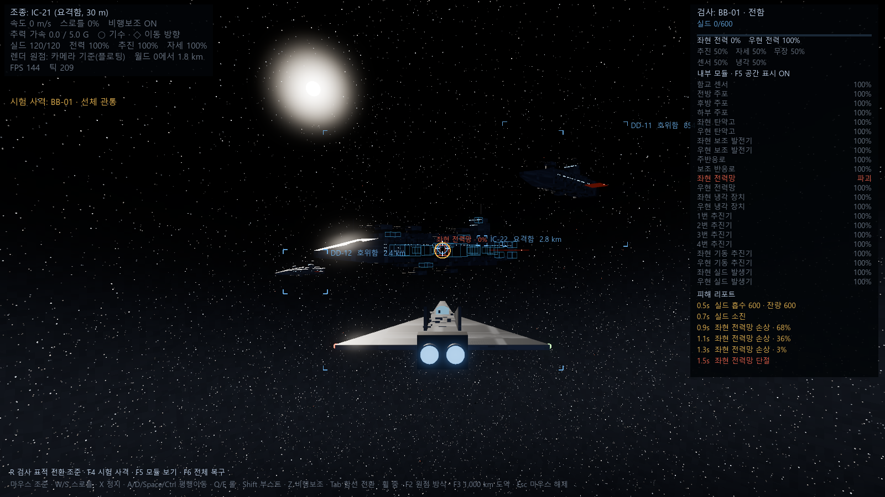
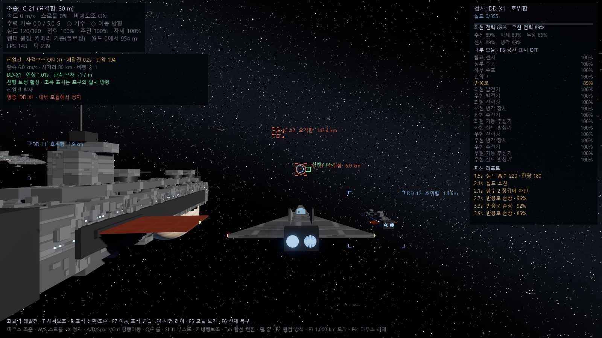

# Project Fleet — 개발 계획

3D 우주 함대전. 초장거리 센서·전자전에서 시작해 포격전, 모듈 정밀타격, 근접 난전으로 좁혀 가는 15~20분 전투.

## 확정된 결정

| 항목 | 결정 | 이유 |
|---|---|---|
| 엔진 | Godot 4.7 (.NET) | 우주 장면은 Godot이 약한 지형·식생·GI가 거의 없다. 가볍고 텍스트 기반이라 반복이 빠르다. |
| 언어 | C# | 탄도·센서·모듈 피해 등 시뮬레이션 비중이 크다. 정적 타입과 성능이 필요하다. |
| 멀티플레이 | 나중에 | 7단계(버티컬 슬라이스)까지는 AI전으로 재미를 먼저 검증한다. |
| 시뮬레이션/연출 분리 | 0단계부터 | `src/Sim`은 Godot 노드에 의존하지 않는 60Hz 고정 틱이다. 나중에 서버 권한형으로 옮길 때 이 층만 서버에서 돌린다. |
| 좌표 | 시뮬레이션 double, 렌더 float | 매 프레임 렌더 원점(조종함)을 빼서 float로 변환한다(연속 플로팅 오리진). 노드를 주기적으로 옮기는 방식보다 단순하고 튀지 않는다. |
| 스케일 | 1 유닛 = 1 m | 전함 1,200 m, 호위함 300 m, 요격함 30 m, 드론 약 6 m. |
| 피해 판정 | 물리엔진 대신 직접 계산 | 레이를 단계별로 진행하며 내부 모듈 볼륨과 교차 판정한다. "2번 추진기 파괴" 같은 결과를 제어하려면 필요하다. |

## 단계

### 0. 기술 검증 — 완료 (2026-10-04)

목표: 1 km 전함 옆을 30 m 요격함이 날 때 "크다"는 느낌이 나는가, 큰 좌표에서 정밀도가 버티는가.

- [x] Godot 4.7.2 .NET + .NET 8/10 SDK 환경, 독립 저장소
- [x] 시뮬레이션 층: `Vec3d`, `ShipBody`(6DOF, 비행보조, 각가속 제한), `SimWorld`(60Hz)
- [x] 두 틱 사이 보간 + 카메라 기준 렌더링
- [x] 마우스 조준 추적 카메라, 수평선이 조종함 롤을 따라감
- [x] 함종 3종의 기동 특성(전함 180° 롤 약 20초)
- [x] 절차적 함선 외형: 패널 무늬, 그리블, 현창 조명 열, 엔진 화염, 상·하부 다른 포탑 배치
- [x] 전함 주위 드론 무리, 150 km 밖 적 함대, 원경 가스 행성(시야각 유지 임포스터)
- [x] HUD: 조준선, 기수 표시, 원거리 표적 브래킷(겹침 정리)
- [x] F3 1,000 km 도약 후에도 정상 렌더링(스크린샷으로 확인)
- [x] 직접 조종해 보며 조작감·스케일감 확인 (1단계 조작감 조정에서 사용자 확인)
- [x] F2로 월드 0 고정 렌더를 켜고 1,000 km 지점에서 떨림이 보이는지 확인 (사용자 확인)

알아낸 것:
- 카메라 원거리 평면을 2억 m로 잡으면 Godot 라이트 컬러의 절두체 계산이 깨져 장면이 사라진다. 1,000 km로 두고, 그보다 먼 천체는 같은 시야각으로 당겨 그린다.
- AgX 톤매핑은 밝은 발광을 흰색으로 몰아서, 뒤에서 본 엔진이 쉽게 포화된다. 정지 상태의 짧은 화염은 숨긴다.

### 1. 조종감 — 기본 구현 완료 (2026-10-05)

요격함 6DOF 마우스 비행, 전함의 느린 선회와 롤, 호위함의 중간 감각을 실제 플레이로 조정한다. 충돌(최소한 함선끼리)을 넣는다.

- [x] 비행보조 ON: 속도·횡추력에 따른 선회율 제한, 큰 선회 입력에 자동 감속 후 재가속
- [x] 합산 병진 가속도 상한: 요격함 5G, 호위함 2G, 전함 0.5G. 제동·횡추력·부스트 포함
- [x] 비행보조 OFF: 기수와 이동 방향을 독립적으로 유지, 무추력 관성 보존
- [x] HUD에 G, 선회 감속 상태, 실제 이동 방향 표시
- [x] `tools/check-sim.ps1`: 실제 시뮬레이션 코드로 합산 G, 속도별 선회, 180도 선회, 보조 OFF, 평행이동·후진·정지 검증
- [x] 실제 플레이로 조작감 조정 (사용자: 이전보다 훨씬 나아짐)
- [x] 비행보조 방식 비교(V): 항공식(기수 선회를 속도에 묶음, 기존) ↔ 우주식(기수 자유, 횡추력 우선 정렬)
- [x] 이동 방향 단서: 우주 먼지, 진행 ◇·역진행 ⊗, 화면 밖 화살표, 1~5초 예측 위치, 미끄럼 각도·정렬 예상 시간
- [x] 두 방식을 실제로 타 보고 기본 방식 결정: 우주식 (사용자, 이동 방향 단서로 알아보기 쉬워짐)
- [x] HUD를 도형·게이지 중심으로 재구성: 조준선 탄약·재장전 호, 계기판(속도·미끄럼 다이얼·G), 계통 막대, 표적 상면·측면 도면

비행 방식 메모(2026-10-05):
- 처음 구현(기수 자유, 횡추력만으로 이동 방향 정렬)은 기수를 돌렸을 때 실제 이동 방향을 알기 어려워 항공식으로 바꿨다.
- 원인은 기수 자유 자체보다 이동을 체감할 배경 단서가 없었던 데 있다고 보고, 우주식을 단서와 함께 다시 넣어 비교한다.
- 우주식의 고속 미끄럼 시간은 5G 한계의 물리량이라 줄일 수 없다(380 m/s 90° 정렬 약 10초). 대신 그동안 기수는 이미 표적을 향한다.
- [x] 함선 간 충돌: 주선체·함교·날개·방열판의 복합 OBB, 연속 이동 구간 검사, 질량별 비탄성 반응과 마찰
- [x] 충돌 HUD: 상대 함선, 접근 속도, 충돌로 인한 속도 변화
- [x] 고속 통과·동시 접촉·회전 접촉·초기 겹침·지속 추력·1,000km/1,000,000km 좌표에서 충돌 검증

첫 조정의 계산 검증(요격함, 스로틀 100%, 180도 목표 방향):
- 초기 100 m/s → 기수와 이동 방향이 새 방향으로 정렬되기까지 약 3.55초
- 초기 380 m/s → 약 10.20초, 최저 속도 약 17.5 m/s
- 초기 760 m/s(부스트) → 약 20.50초
- 보조 ON에서는 위 조건에서 뒤로 날아가는 구간 없이 감속하며 회전한다. 5G 한계에서 고속 반전은 시간이 걸린다.
- 병진 G만 제한하며 승무원 위치의 회전 가속도는 아직 다루지 않는다.

충돌 구현:
- 외부 틱은 60Hz, 충돌과 자세 변화는 240Hz 하위 틱으로 계산한다. 렌더 보간은 전체 60Hz 틱의 양 끝을 사용한다.
- 질량 기준값: 전함 1.2e10 kg, 호위함 1.5e8 kg, 요격함 1.2e5 kg. 게임 조정용 값이다.
- 충돌 없는 근접 통과는 그대로 허용한다. 깊은 초기 겹침은 전체 선체 외곽으로 분리한다.
- 회전하는 부품의 접촉면 속도도 반응에 반영한다. 충격으로 생기는 각속도 변화는 아직 구현하지 않았다. 큰 충격의 내부 모듈 피해는 2단계에서 연결했다.
- G 상한은 추진기에 적용하며 충돌 충격을 제한하지 않는다.
- `tools/check-sim.ps1`: 기동 38개 + 충돌/월드 73개 검증 통과. 월드에서 380 m/s 180도 선회 약 10.23초.

### 2. 피해 모델 — 기본 구현 완료 (2026-10-05)

- [x] `data/ships/*.json`: 기동, 충돌 선체, 실드, 면별 장갑 두께·경사, 내부 모듈 배치(센서, 주포, 탄약고, 발전, 반응로, 냉각, 추진기, 전력망, 실드 발생기)
- [x] 데이터 검증: 양의 크기·질량·체력, 모듈의 선체 내 배치, ID와 추진기 번호 중복 검사
- [x] 실드 흡수와 피격 후 지연 회복, 발생기·전력·냉각에 따른 성능 저하
- [x] 입사각·장갑 경사 → 관통력 소모 → 내부 모듈의 경로 순 피해 → 출구 장갑
- [x] 좌현·우현 전력망과 반응로·보조 발전의 중복성, `좌현 전력망 단절` 같은 피해 리포트
- [x] 모듈 피해를 추진·자세 제어·부스트·실드 회복·개별 엔진 화염에 연결
- [x] 고에너지 탄약고·반응로 파괴 시 낮은 확률의 치명 파괴. 함선·사격 순번을 기준으로 재현 가능한 판정
- [x] ~~큰 충돌의 속도 변화로 접촉점 근처 3개 모듈에 피해~~ → 충돌 에너지 기준으로 교체(2026-10-05): 양쪽 선체 모두 피해, 구조 한계 초과 시 붕괴, 미만이면 접촉점에서 장갑·모듈 관통 계산으로 파쇄(실드 무시), 작은 함선일수록 크게 부서짐
- [x] 반응로가 숨은 HP 막대가 되지 않게 수정(2026-10-05): 발전 여유 25%, 발전 모듈 출력 2단계(정격·50%·0), 양현 공용 장비는 살아 있는 전력망에서 급전
- [x] R 검사 표적·조준, F4 시험 사격, F5 모듈 공간 표시, F6 전체 복구, 시스템별 상태·모듈별 체력·피해 리포트 HUD
- [x] Godot 장면 검증: BB-01 좌현 전력망 관통 → 좌현 0%, 우현 100%, 추진·자세 50%

구현 범위:
- F4 즉시 레이는 피해 검증용이다. 레일건 탄도·발사 제한·사격통제는 3단계에서 연결했다. 실제 탐지·식별은 5단계에서 진행한다.
- 장갑은 입사각·데이터 경사의 등가 두께로 계산한다. 도탄·재질별 정밀 탄도는 아직 없다. 충돌 피해와 드문 치명 파괴의 확률·임계값도 게임 조정용이다.
- 격침된 선체는 추진력을 잃고 관성으로 떠다닌다. 충돌과 사격 차폐에는 남는다.
- 선체·모듈 배치는 임시 모델 기준이다. 실제 함선을 제작하며 JSON과 추진기 연출 번호를 함께 조정한다.
- `tools/check-sim.ps1`: 기동 38개 + 충돌/월드 73개 + 피해/데이터 117개, 총 228개 검증 통과.

### 3. 사격 — 기본 구현 완료 (2026-10-05)

- [x] 함종별 JSON 주포 정의: 포구·탄속·재장전·탄약·관통력·사거리·사각·관측 오차, 주포 모듈 연결
- [x] 발사 함선의 속도를 이어받는 실제 탄, double 위치, 240Hz 연속 상대 이동 교차 검사
- [x] 명중 시 기존 실드·장갑·내부 모듈 피해로 연결, 사거리의 최대 비행 시간 후 탄 소거
- [x] 상대 위치·속도의 등속 선행 조준, 재현 가능한 관측 위치·속도 오차와 센서 손상 반영
- [x] 좌클릭 발사, T 사격보조 ON/OFF, 선택 표적 8° 이내에서 선행 보정, 주포 사각·자함 선체 차폐 확인
- [x] 주포·전력·탄약고 손상과 탄약 소진 시 발사 제한, 주포·냉각 상태에 따른 재장전
- [x] 예상 비행 시간·관측 오차·발사 준비·탄약·명중 HUD, 예광과 명중 섬광
- [x] F7 이동 표적 연습, 자동 ON/OFF 비교, F6 피해·주포·탄약·탄 초기화
- [x] 계산 검증: 기동 38 + 충돌/월드 73 + 피해/데이터 117 + 탄도/사격통제 78, 총 306개 통과 (우주식 추가 후 기동 44, 총 312개)
- [x] 사격통제 표적은 살아 있는 적으로 제한, 기본 표적은 가장 가까운 적(이전에는 아군 기함 BB-01)
- [x] Godot 6km 이동 표적 검증: 180 m/s 횡이동, 6발 발사 후 4초 시점 ON 5발 명중·1발 비행 중, 현재 위치 수동 조준은 명중 0발·실드 유지
- [x] Godot 장거리 검증: 1,000km 도약한 좌표에서 150km 횡이동 표적에 전함 레일건 명중, 약 12.5초 비행 뒤 실드 소진·2개 모듈 타격

현재 구현 범위:
- 함종별 주포 한 기이며 함선 중심을 선행 조준한다. 개별 모듈 조준은 T로 보조를 끄고 진행한다. 포탑 외형의 회전·여러 주포 운용은 모델과 함께 확장한다.
- 탄은 직선 비행하며 발사 후 표적의 가속·선회를 추적하지 않는다. 관측 오차는 실제 센서·전자전 단계 전의 임시 모델이다.
- 첫 선체 명중 시 내부 관통을 계산하고 탄을 소모한다. 여러 함선 연속 관통·도탄·중력 탄도는 아직 없다.
- 이동 선체의 회전은 240Hz 구간 중앙 자세로 근사한다. 탄속·피해량·사거리·재장전은 게임 조정용 값이다.
- 발사의 전력 소비·폐열 누적은 다음 단계에서 붙인다.

### 4. 전력·폐열 — 기본 구현 완료 (2026-10-05)

- [x] 채널 4개(추진·실드·무장·센서), 핍 8개 0~4 배분, 1~4 키·0 균형. ECM은 5단계에서 채널로 추가
- [x] 핍별 성능 0.3·0.65·1.0·1.25·1.5배, 소비 0.15·0.5·1·1.5·2배. 채널은 활동할 때만 전력을 끈다
- [x] 발전량(반응로·발전기 출력 단계)과 전력망 연결(버스)을 분리. 수요 > 가용이면 모든 채널 비례 전압 강하. 2단계 임시 "발전 여유 25%"를 대체
- [x] 폐열: 소비 전력 = 발열, 레일건 발사 열, 냉각 모듈 방열, 과열 시 전 채널 절반·발사 불가, 70%에서 회복
- [x] 부스트의 대가를 냉각 배율에서 폐열로 변경. 냉각 손상은 추력을 직접 깎지 않고 열이 빠지지 않게 한다
- [x] 보조 추진기 단가 분리: 횡·상하·제동·후진 가속은 메인의 30% 전력. 미끄럼 보정 순간 피크 114% → 38%(요격함)
- [x] HUD 소비 막대·수요선 약 0.3초 평활화
- [x] 보조 추진기 시각화: 전 함종 같은 배치(함수·함미 좌우 1·상하 2씩, 함수 역추진 2), 병진·피치·요·롤에 맞춰 분사
- [x] HUD: 발전·수요 막대, 채널 핍과 소비 막대, 열 막대(회복선·과열선·상승 표시), "과열"·"전력 부족" 칩
- [x] 검증: 전력/열 28개(핍 규칙, 채널별 1.5배 효과, 보조 추진기 단가, 전압 강하, 과열·회복, 냉각 손실), 총 351개 통과

조정 기준(게임 조정용 값):
- 요격함 부스트·연사·실드 재충전 동시 → 약 20초 과열, 회복 약 6초. 부스트 단독은 지속 가능. 냉각 전손 시 대기 약 90초 과열
- 전함 주반응로 상실 + 모든 채널 최대 활동 → 공급 약 73%
- 열 용량/냉각: 요격함 600 MJ/42 MW, 호위함 4,500 MJ/330 MW, 전함 20,000 MJ/1,500 MW

### 5a. 센서·전자전 — 기본 구현 완료 (2026-10-06)

- [x] 진영별 센서망(0.25초 갱신, 데이터 링크 공유): 미탐지 → 접촉 → 식별 → 잠금, 하강 히스테리시스 80%
- [x] 신호 = 관측 세기 × 표적 신호 ÷ km². 표적 신호는 크기·엔진 출력·열로 커진다
- [x] ECM을 다섯째 전력 채널로(기본 0핍). 식별·잠금 신호를 나누고, 대신 접촉 신호는 키운다. 센서 핍이 ECCM 역할
- [x] 사격통제는 잠금일 때만 해를 내고, 방해·신호 세기로 오차 배율(√(1+방해), 강한 신호면 최대 ½)
- [x] HUD: 접촉 "?"·오차 원, 식별 브래킷, 잠금 마름모, 방해 물결, 표적 패널 탐지 단계 막대·"미식별 접촉", 전력 패널 ECM 칸, "ECM" 칩
- [x] 적 전함·호위함 기본 ECM, 미탐지 적은 R로 선택 불가
- [x] 접촉 표시 안정화: 추정 오차가 0.15Hz로 천천히 흐름(4Hz 갱신마다 수 km 튀던 문제), 겹친 접촉 묶음 표시("? ×3")
- [x] 검증: 센서/EW 25개(단계 거리, 데이터 링크, ECM·ECCM, 신호, 히스테리시스, 센서 파괴, 사격통제 연동, 월드 갱신), 총 376개 통과
- [x] Godot: 150 km 시작 시 적은 접촉만, 90 km 전함 대 ECM 전함은 식별 → 센서 4핍으로 잠금, 50 km 잠금 사격 명중

거리 기준(조정용): 전함 센서 1150, 호위함 800, 요격함 60 / 신호 전함 100, 호위함 20, 요격함 3 / 방해 전함 2, 호위함 3, 요격함 1

### 5b. 미사일·디코이·근접방어 — 기본 구현 완료 (2026-10-06)

- [x] 미사일: 접촉 이상 표적에 발사, 센서망 중간 유도 → 탐색기 종말 유도(신호 ÷ ECM, 0.5초마다 재선택), 비례항법, 연소·관성, 근접신관 → 기존 관통 피해
- [x] 함종별 데이터(`missiles`·`pointDefense`·`decoys`), 무장 채널 재장전, 발사 열, 탄약고 손상 시 발사 불가, F6 초기화
- [x] 디코이: 신호 2.5~3배에서 꺼짐, 탐색기를 신호 비율만큼 끌어감
- [x] 근접방어: 포대별 자동 사격, 거리·가로지르는 속도·센서·무장 채널 명중률, 미사일 체력, 아군 함선 상호 방어
- [x] 우클릭 미사일, C 디코이, F8 미사일 훈련(적 호위함 6발), HUD 미사일 표시·경보·잔량 호, 3D 화염·디코이·예광·폭발
- [x] 검증: 미사일/근접방어/디코이 18개(정지·가로지르는 표적 명중, 근접방어·디코이 효과, 발사 규칙, 1e9 m 좌표), 총 395개 통과
- [ ] 요격드론(함재 드론 관제): 6단계 함대 지휘와 함께

알아낸 것:
- 한 척이 4~5초 간격으로 한 발씩 쏘면 전함 근접방어가 모두 막는다(F8 훈련 6/6 요격). 뚫으려면 여러 척 동시 일제 사격·디코이로 탐색기를 흔드는 운용이 필요하다. 6단계 AI에서 일제 사격을 다룬다.

### 6. 함대 지휘·AI — 기본 구현 완료 (2026-10-06)

- [x] `src/Sim`의 함선 AI(ShipBrain): 명령(호위·공격·위치 유지), 센서망 정보만 사용, 0.25초 판단 + 매 틱 조종
- [x] 이동: 대형 자리 유지, 함종별 대치 거리·요격함 공격 기동, 충돌 회피(10초 최근접 예측), 잠기지 않으면 접근
- [x] 사격: 레일건(잠금·비행 시간 기준·아군 사선 확인), 미사일 일제 사격 창(합류 대기), 디코이, 전력 자동 배분(근접방어·ECCM·과열 시 ECM 끔)
- [x] 함대 지휘관: 함종별 표적 선호·분산 배정·무력화 적 후순위, 호위함은 사거리 전까지 기함 호위
- [x] 플레이어 편대: G 공격·H 호위·J 위치 유지, Tab 전환 시 AI 인계, HUD 명령 선·칩
- [x] 시간 배속 ×1·×4·×16, 무력화 상태(발전 없음 또는 추진·자세 전손)
- [x] 검증: AI/함대 18개, 총 413개 통과
- [x] 편대 편성(2026-10-06): 진영마다 전투단(BB+DD2)·호위 전대(DD4)·요격 편대(IC5), 역할별 행동(대치 포격+근접 호위 / 측면 기동·방공 복귀 / 경계·요격·집결 후 동시 돌격), 플레이어는 탄 함선의 편대만 지휘, 편대 현황 HUD
- [x] 근접방어 약화: 단독 호위함 6발 중 5발 요격 → 2발, 전투단 8발 일제 사격 3발 요격·5발 명중. 미사일 명중률(전면전) 약 5% → 약 45%
- [x] 검증 432개 통과. 24척 20분 전면전에서 약 절반이 격침·무력화
- [x] 요격함 침투(2026-10-06): 근접방어 포대 사계(전함 배면·후미 아래 사각), 근접방어의 대요격함 사격, 방열판 냉각 모듈, 부위 조준(Y·AI 공용)과 관통 미리보기, AI 후미 아래 우회 침투, 모듈 피해식 수정(현 길이 기준). 검사 444개
  - 혼자 둔 전함은 요격함 1척에 4분 안에 추진 0%. 전투단 호위함의 사각 엄호가 실제로 중요해졌다
  - 전면전 24척 중 15척 격침·무력화, 처음으로 전투단 전멸 발생. 아군 쪽이 일관되게 불리한 비대칭이 있다(배치 고도 차이 등, 7단계에서 확인)

알아낸 것(7단계 밸런스 과제):
- (편대 편성 전) 20분 안에 전함·호위함이 격침되지 않았다. 근접방어 약화·편대 행동 뒤 호위 전대·요격 편대는 10~15분에 소모되지만, 양쪽 전투단은 60 km 대치에서 끝까지 남는다. 관통 탄의 상당수가 모듈 없는 빈 공간을 지난다.
- ECM 양측 사용 시 30 km 대치에서도 호위함끼리 식별이 어렵다. AI의 ECCM 대응이 교전 양상을 크게 바꾼다(작은 변경에도 레일건 사격 수가 수배 차이).
- 편대 공격 명령을 내리면 빠른 요격함이 먼저 적 함대에 뛰어들어 몇 분 만에 무력화된다. 함종별 명령 분리나 "편대 속도 맞추기"가 필요할 수 있다.

### 함종별 조작 체계 (2026-10-06)

- [x] 1차: 요격함 마우스 조함 유지, 호위함·전함 키보드 요·피치·롤, Alt 평행추력, 함선 추종 카메라와 중클릭 자유 관찰. `HelmForward`와 직접 각속도 입력 분리.
- 검증: 기존 444개 + 조함 6개. AI 전투 기준 결과 비교, DD 요·BB 롤 스크린샷.
- [x] 2차: AI·플레이어 공용 자동 사격, 5개 교리, 모듈·브래킷 클릭 선택, 커서 수동 사격, 사격 HUD와 선체 가림 경고.
- 검증: 자동 사격 10개 추가, 총 460개. 전함 아래 8 km 표적은 발사 0, 롤 후 발사. AI 전투 기준 결과 동일.
- [x] 3차: Helm T 교리 순환과 짧은 알림, Pilot T 사격보조 유지. 빌드·460개 검사·교리 HUD 화면 확인.
- [x] 4차: 공용 라디얼 계산·단일 실행 수명·섹터 HUD, F 전력 프리셋, 캡처/자유 커서, 클릭 차단과 취소, 검증 CLI와 도움말 구분.
- 검증: 라디얼·전력 33개 추가, 총 493개. 화력 선택 1/1/4/2/0, 중앙 취소 2/2/2/2/0, 두 조작 방식 화면 확인. 직접 조작감은 미확인.
- [x] 5차: B 교리·일제사격, N 호위/요격/집중/복귀/위치유지 라디얼. 2초마다 근처 요격함 분산 배정, 복귀 시 공격 해제, 내 편대 HUD 갱신.
- 검증: 편대 9개·선택 표적/모듈 우선순위·AI 소유권 5개 추가, 총 507개. 라디얼 무력화 칩과 집중공격 점선 화면 확인. 기존 `--look-at`/`--turn` 관찰 인자도 조함 카메라에서 유지.
- 최종 빌드 오류 0, 신규 컴파일 경고 0. 507개 검사 통과, `Fleet attack`·`Full battle`의 발사/명중/손상 결과가 작업 전 기준과 동일. NuGet 취약성 데이터 조회의 기존 네트워크 경고(NU1900)는 남아 있다.
- 단계별 화면: `shots/helm_yaw.png`, `helm_roll.png`, `gunnery_focus.png`, `gunnery_blocked.png`, `gunnery_rolled.png`, `gunnery_hold.png`, `radial_power_helm.png`, `radial_power_pilot.png`, `radial_power_release.png`, `radial_power_cancel.png`, `radial_disable.png`, `radial_squad_focus.png`.
- 실제 손으로 조작한 조함·카메라·라디얼의 감각은 미확인. 드론·다중 주포·다른 편대 지휘·최종 UI·밸런스는 작업 범위에서 제외.
- [x] 검수 수정: 화면 밖 방향 표시(미사일 채운 삼각형 · 적 함선 빈 화살촉 · 사격 표적 고리, 진행 방향과 띠 분리), 글자 "롤 필요" 대신 사격 방위구(포각·선체 가림 영역과 표적 점)와 표적 ⊘·빨간 선행점, 사격 패널을 계기판 오른쪽으로 옮겨 자함 모델을 가리지 않게 함. 발사 실패 사유를 문구 대신 `FireFailure` 코드로, 무력화 자동 부위에서 내부 냉각기 제외(겉 방열판만), 자율 표적 거리를 센서 추정 위치로, `SquadCommands`를 `src/Sim`으로 이동.
- 검증: 사격 검사 5개 추가, 총 512개 통과. `Fleet attack`·`Full battle` 결과 이전과 동일. 화면: `shots/fx_bb_below.png`(아래 표적 · 방위구 하단 빨강 X), `fx_bb_side.png`(롤 중 · 초록 점), `fx_bb_roll.png`(계속 롤해 다시 가림 · 화면 밖 ⊘), `fx_offscreen.png`(화면 밖 미사일·표적).

### 7. 버티컬 슬라이스

3함종, 20척 규모로 AI와 싸우는 전투 1판. 장거리 → 포격 → 난전 흐름이 15~20분 안에 실제로 생기는지 검증한다.

### 8. 이후

멀티플레이(팀전), 장비 슬롯 빌드, 추가 함종(캐리어, 전자전함, 아스널십, 부유포대).
